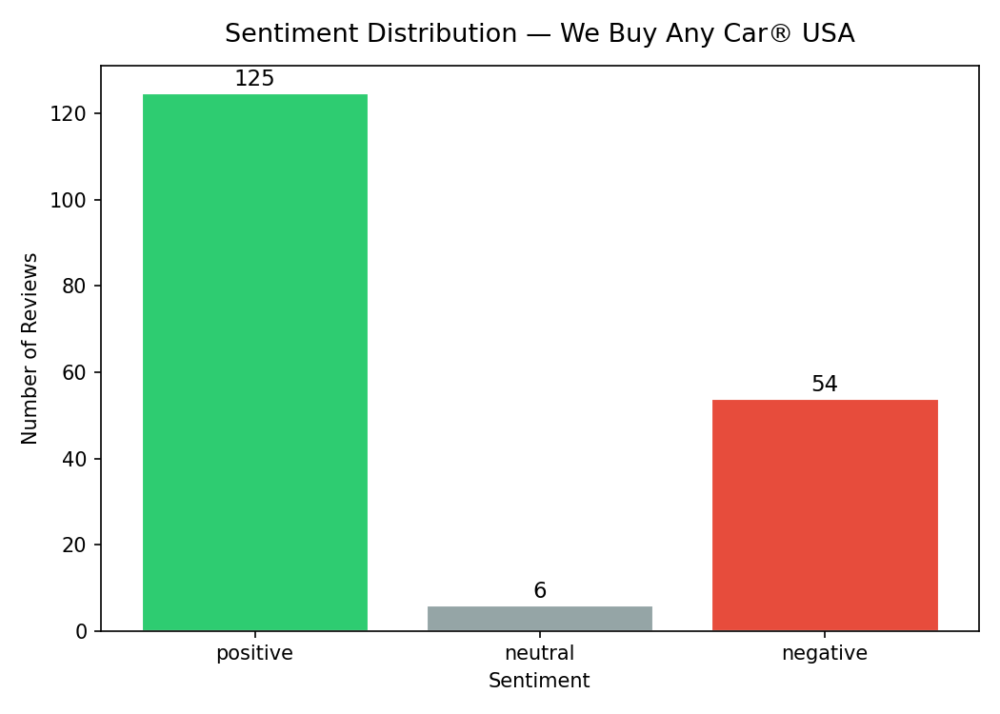
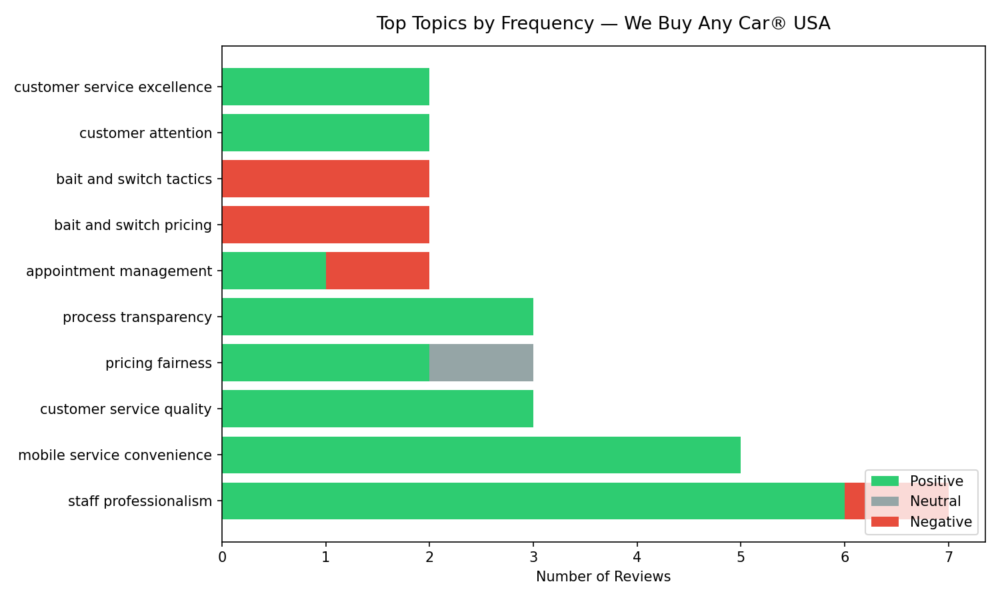
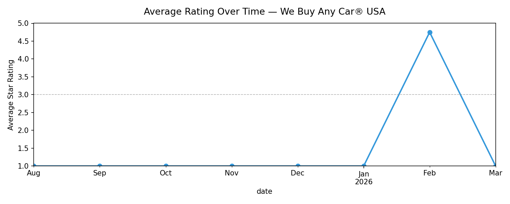

# Trustpilot Sentiment Analyzer

A Jupyter notebook pipeline that scrapes Trustpilot reviews, tags each review with sentiment and topic using Claude, and generates a PM-ready report with themes, pain points, and product recommendations.

---

## The Problem

PMs reviewing Trustpilot pages face a manual pattern: read dozens (or hundreds) of reviews, mentally group them into themes, and try to extract signal for roadmap decisions. The process doesn't scale — 500 reviews across 5 competitors is a full day of work with no structured output.

This tool automates the entire pipeline: scrape → classify → synthesize → report. In under 10 minutes you have a structured breakdown of what customers love, what they hate, and what the product team should prioritize.

---

## The Solution

```
Trustpilot URL → Scraped reviews → Sentiment + topic tags → Theme synthesis → PM report
```

**Input:** Any Trustpilot company URL (filter by star rating with `?stars=1`)

**Output:**
- Per-review sentiment (`positive` / `neutral` / `negative`) and topic label
- Top 5 themes with sentiment skew
- Biggest pain points and strongest strengths
- 3 actionable PM recommendations
- Charts: sentiment distribution, topic breakdown, rating trend over time
- Exported CSV for further analysis

---

## Quickstart

### 1. Clone the repo

```bash
git clone https://github.com/elmarto87/trustpilot-sentiment-analyzer.git
cd trustpilot-sentiment-analyzer
```

### 2. Install dependencies

```bash
pip install -r requirements.txt
```

### 3. Set up your API key

```bash
cp .env.example .env
# Edit .env and add your Anthropic API key
```

### 4. Run the notebook

```bash
jupyter notebook main.ipynb
```

Set `TRUSTPILOT_URL` in Cell 1 to any Trustpilot company page and run all cells.

---

## Configuration

| Parameter | Description | Default |
|---|---|---|
| `TRUSTPILOT_URL` | Target Trustpilot page | `webuyanycarusa.com` |
| `MAX_PAGES` | Cap pages scraped (None = all) | `5` |
| `delay` in `TrustpilotScraper` | Seconds between requests | `1.5` |

**Filter by star rating:** Append `?stars=1` to focus analysis on 1-star reviews — useful for deep-diving into failure modes before a planning cycle.

---

## Example Output

*Run on WeBuyAnyCar USA — 185 reviews (1-star filter), March 2026*







**Top themes Claude identified:**
- `staff professionalism` — positive skew — Named reps consistently praised for transparency and no-pressure approach; high variance between locations
- `mobile service convenience` — positive skew — At-home appraisal model is a standout differentiator customers highlight unprompted
- `bait and switch pricing` — negative skew — Customers report online quotes significantly higher than in-person offers with no clear explanation
- `process transparency` — mixed — Smooth when reps walk through the inspection; frustrating when they don't

**PM Recommendations (Claude-generated):**
1. Replace peak-estimate online quotes with a realistic range and condition factors upfront — directly kills the #1 driver of 1-star reviews
2. Standardize the inspection walkthrough as a required step — best reps already do this; codify it to reduce experience variance across locations
3. Introduce appointment reliability SLAs with accountability tracking — canceled/no-show appointments appear repeatedly in negative reviews

---

## Tradeoffs and Decisions

**1. Two-model architecture: Haiku for tagging, Sonnet for synthesis**

Tagging 500 reviews with Sonnet would be slow and expensive. Haiku handles repetitive classification tasks (sentiment, topic label) fast and cheaply. Sonnet's stronger reasoning is reserved for the synthesis step — identifying cross-review patterns and generating recommendations — where output quality matters more. This reduced per-run cost by approximately 80% vs. using Sonnet throughout.

**2. Batch tagging (25 reviews per API call) vs. per-review calls**

A single API call per review would generate clean, isolated results but 500 reviews = 500 API calls. Batching 25 reviews per call drops that to 20 calls with comparable accuracy. The tradeoff: occasional misclassifications when reviews in a batch share similar language, which the aggregate synthesis step smooths out.

**3. Scraping vs. Trustpilot's official API**

Trustpilot offers a business API, but it requires a paid plan and company ownership verification. Scraping makes this tool accessible to any PM analyzing any competitor — which is the primary use case. The scraper uses polite delays (1.5s between requests) and broad CSS selectors to be resilient to Trustpilot's frequent class name updates.

---

## What I Learned

- Batching reviews in groups of 25 gives the model enough context to normalize topic labels across reviews (it notices when two differently-worded complaints are about the same issue). Smaller batches produce noisier, less consistent topic names.
- Filtering by star rating before scraping (`?stars=1`) is more useful than analyzing all reviews together for root-cause analysis — negative reviews have much higher signal density for product issues than mixed-star analyses.
- Trustpilot's HTML class names are generated by CSS modules and change every few weeks. Relying on partial class name matching (`class_=lambda c: c and "reviewCard" in c`) is significantly more resilient than exact class strings.

---

## Limitations

- Trustpilot's Terms of Service prohibit automated scraping — use this tool for research and educational purposes only
- CSS class selectors may need updating if Trustpilot changes their markup
- Analysis quality degrades for companies with fewer than ~50 reviews (small sample sizes make theme clustering unreliable)
- Requires an [Anthropic API key](https://console.anthropic.com/) — Claude Haiku costs are minimal (~$0.01–0.05 per full run of 500 reviews)

---

## Requirements

- Python 3.9+
- Anthropic API key
- See `requirements.txt` for package versions
